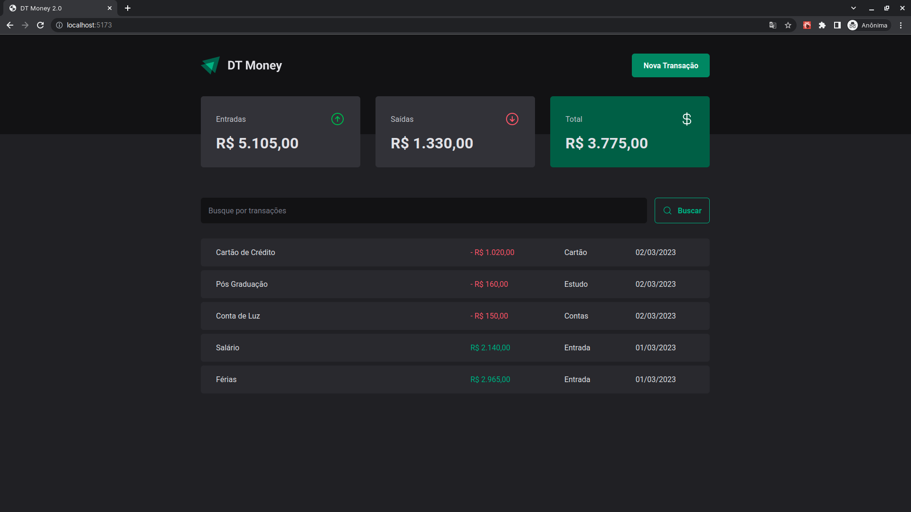

## DT Money 2.0

<h1 align="center">
    
</h1>

DT Money 2.0 é a evolução de sua versão anterior com um novo desing e novas tecnologias que tem como grande objetivo resumir de forma visual todas as entradas e saídas financeiras do usuário sendo permitido o mesmo cadastrar uma entrada e uma saída de valor.

## Aprendizados

Com a construção deste projeto, foi proporcionado a aplicação prática de conceitos de criação de comunição uma API via protocolos HTTP, aplicação de conceitos como React Hook Form, useMemo e useCallback.

Por que um componente renderiza?
- Hooks changed (Mudou o estado, contexto, reducer);
- Props changed (Mudou propiedades)
- Parent rerendered (Componente pai renderizou);

Qual fluxo de renderização?

1 - O React recria o HTML da interface daquele componente
2 - Compara com a versão do HTML recriada com a versão anterior
3 - SE mudou alguma coisa, ele reescreve o HTML na tela

### Stack utilizada

**Front-end:** React.JS, Typescript, Styled Components, JSON Server e Axios.

### Funcionalidades

- Cadastro de valores de entrada e saída
- Busca por um determinado item

## Rodando o Projeto

Clone o projeto

```bash
  git clone https://github.com/diego64/DTMoney-2.0
```

Entre no diretório do projeto

```bash
  cd DTMoney-2.0
```

Instale as dependências

```bash
  npm install
```

Inicie o backend (JSON Server)

```bash
  npm run dev:server
```

Inicie o servidor

```bash
  npm run dev
```